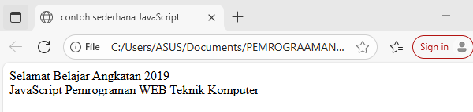
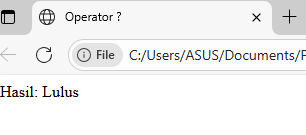

## Analisis Laporan

## 1. Percobaan2a.html

Kode HTML pada percobaan ini merupakan contoh implementasi JavaScript yang diletakkan pada dua lokasi berbeda dalam struktur dokumen. Dokumen ini memiliki judul "contoh JavaScript" yang ditentukan dalam tag <TITLE>. Pada bagian <HEAD>, terdapat script JavaScript pertama yang menggunakan metode document.write() untuk menampilkan teks "Program JavaSript Aku di kepala". Penempatan script di head menyebabkan kode ini dieksekusi selama proses loading halaman, sebelum konten body dirender, sehingga teks akan muncul di bagian paling atas halaman.

Selanjutnya, dalam tag <BODY>, terdapat script JavaScript kedua yang juga menggunakan document.write() untuk menampilkan teks "Program JavaSript Aku di body". Script yang diletakkan di body ini akan dieksekusi ketika browser melakukan parsing dan mencapai titik tersebut dalam dokumen, sehingga teks akan ditampilkan di dalam body halaman. Output akhir dari kode ini akan menampilkan dua baris teks berurutan: pertama teks dari head diikuti teks dari body.

## 2. Percoabaan2b.html
Kode HTML ini menunjukkan implementasi JavaScript yang diletakkan di dua lokasi berbeda sama halnya pada Percobaan2a.html dan hanya saja pada Pecobaan ini mencoba memuat file JavaScript eksternal yang ditentukan dalam tag  

## Percobaan2C.html

Kode HTML ini merupakan contoh implementasi event handling dalam JavaScript yang fokus pada penggunaan event onclick. Dokumen ini memiliki judul "Belajar Javascript : Mengenal Event Pada Javascript" dan menampilkan dua heading yang menjelaskan tentang event pada JavaScript dan program web event one click. Pada bagian <body>, terdapat sebuah elemen button yang telah diberi event handler onclick secara inline yang memanggil fungsi tampilkan_nama() ketika tombol diklik oleh pengguna.

Setelah tombol, terdapat elemen div kosong dengan <id="hasil"> yang berfungsi sebagai tempat untuk menampilkan output dari fungsi JavaScript. Dalam tag script, didefinisikan fungsi tampilkan_nama() yang akan mengeksekusi perintah untuk mengubah innerHTML dari elemen dengan id "hasil" menjadi teks heading yang berisi nama "Andi Akram Nur Risal" ketika tombol diklik.
Dimana eventHandler adalah nama dari event tersebut.

## 3. Percobaan2d.html

a. Struktur HTML
Dokumen menggunakan struktur HTML dasar
Tag <TITLE> berisi judul "contoh sederhana JavaScript"
b. Implementasi JavaScript
Menggunakan metode document.write() untuk menulis konten langsung ke dokumen
Terdapat dua perintah document.write():
Pertama: Menampilkan "Selamat Belajar Angkatan 2019" diikuti line break ( )
Kedua: Menampilkan "JavaScript Pemrograman WEB Teknik Komputer"

## 4. Percobaan3.html

    1. Struktur HTML
Tag <TITLE> berisi judul "Masukan Data" yang sesuai dengan fungsi kode
Struktur tag lengkap dan benar: <HTML>, <HEAD>, <BODY>

    2. Implementasi JavaScript
Menggunakan prompt() untuk mengambil input dari pengguna
Menyimpan input dalam variabel nama
Menggunakan document.write() untuk menampilkan pesan sapaan
Menggunakan komentar HTML (<!-- -->) untuk menyembunyikan kode dari browser lama

    3. Alur Eksekusi
Browser memuat halaman dan menjalankan script
Muncul dialog prompt bertanya "Siapa nama Anda?"
Pengguna memasukkan nama
Script menampilkan "Hai, [nama]" pada halaman

## 5. Percobaan4contoh1.html

Kode HTML ini merupakan contoh penggunaan alert() box dalam JavaScript untuk menampilkan pesan dialog kepada pengguna. Kode ini demonstrasi sederhana bagaimana JavaScript dapat menampilkan pesan peringatan atau konfirmasi kepada pengguna saat halaman web dimuat.
    1. Struktur HTML
Dokumen menggunakan struktur HTML dasar yang valid
Tag <TITLE> berisi judul "Alert Box" yang sesuai dengan fungsi kode
Struktur tag lengkap dan benar: <HTML>, <HEAD>, <BODY>

    2. Implementasi JavaScript
Menggunakan window.alert() untuk menampilkan dialog box
Pesan yang ditampilkan: "Apakah anda akan meninggalkan laman ini?"
Menggunakan komentar HTML (<!-- -->) untuk menyembunyikan kode dari browser lama

    3. Alur Eksekusi
Browser memuat halaman dan menjalankan script
Muncul dialog alert dengan pesan "Apakah anda akan meninggalkan laman ini?"
Pengguna harus mengklik "OK" untuk melanjutkan  
Setelah alert ditutup, halaman akan ditampilkan (meski kosong)

## 6. Percobaan4contoh2.html

Kode HTML ini merupakan contoh penggunaan confirm() box dalam JavaScript untuk mengambil keputusan dari pengguna melalui dialog konfirmasi. Kode ini demonstrasi interaksi dasar dimana sistem meminta konfirmasi dan menampilkan hasil jawaban pengguna.
    1. Struktur HTML
Dokumen menggunakan struktur HTML dasar yang valid
Tag <TITLE> berisi judul "Konfirmasi" yang sesuai dengan fungsi kode
Struktur tag lengkap dan benar: <HTML>, <HEAD>, <BODY>

    2. Implementasi JavaScript
Menggunakan window.confirm() untuk menampilkan dialog konfirmasi
Menyimpan hasil konfirmasi dalam variabel jawaban
Menggunakan document.write() untuk menampilkan hasil
Pesan konfirmasi: "Apakah anda sudah yakin ?"

    3. Alur Eksekusi
Browser memuat halaman dan menjalankan script
Muncul dialog confirm dengan pesan "Apakah anda sudah yakin ?"
Pengguna memilih "OK" (true) atau "Cancel" (false)
Script menampilkan "Jawaban Anda: true" atau "Jawaban Anda: false"

## 7. Percobaan5a.html

Kode JavaScript ini demonstrasi dasar deklarasi variabel, assignment nilai, dan operasi aritmatika. Kode menunjukkan cara kerja variabel dan operasi perkalian dalam JavaScript.

## 8. Percobaan5b.html

    1. Variabel Scope
Variabel a adalah global
Parameter b dalam fungsi shadow variabel global b
Fungsi mengubah nilai variabel global a

    2. Alur Eksekusi
a = 12, b = 4 (global)
Memanggil Perkalian_Dengan2(b) dengan nilai 4
Dalam fungsi: a = 4 * 2 → a = 8
Return 8
Variabel global a sekarang bernilai 8

## 9. Percobaan5b2.html

Kode JavaScript ini demonstrasi konsep variable scope dan shadowing dalam fungsi. Kode menunjukkan perbedaan antara variabel global dan lokal.

    1. Variable Shadowing
Parameter b dalam fungsi menutupi (shadow) variabel global b    
Variabel a dalam fungsi adalah variabel lokal baru, bukan variabel global a

    2. Scope Variabel
Variabel global: a = 12, b = 4
Variabel lokal dalam fungsi: a = 8 (hanya ada dalam scope fungsi)
Parameter fungsi: b (nilainya sama dengan global b = 4)

    3. Alur Eksekusi
Variabel global a = 12, b = 4
PerkalianDengan2(b) dipanggil dengan nilai 4
Dalam fungsi: var a = 4 * 2 → membuat variabel lokal a = 8
Return nilai lokal a = 8
Variabel global a tetap 12 (tidak terpengaruh).

## 10. Percobaan7.html

Kode JavaScript ini demonstrasi penggunaan fungsi parseInt() dan parseFloat() untuk konversi string menjadi bilangan. Kode menunjukkan berbagai skenario konversi dan perilaku fungsi-fungsi tersebut terhadap input yang berbeda.

    1. Fungsi parseInt()
Mengkonversi string menjadi bilangan bulat (integer)
Berhenti membaca ketika menemukan karakter non-numerik
Mengabaikan bagian desimal

    2. Fungsi parseFloat()
Mengkonversi string menjadi bilangan pecahan (floating-point)
Berhenti membaca ketika menemukan karakter non-numerik (kecuali titik desimal pertama)
Menerima format desimal

## 11. Percobaan8.html

Kode JavaScript ini demonstrasi operasi matematika dasar dalam JavaScript. Kode menunjukkan penggunaan operator aritmatika untuk melakukan perhitungan sederhana dan menampilkan hasilnya di halaman web.

    1. Operasi Aritmatika yang Ditunjukkan
javascript
2 + 3    // Penjumlahan
20 - 3   // Pengurangan (meskipun tertulis + di string)
20 * 3   // Perkalian
40 / 3   // Pembagian
    2. Format Output
Menggunakan document.write() untuk menampilkan hasil
Menggunakan concatenation string dengan operator +
Tag   untuk line break

## 12. Percobaan9.html

    1. Fungsi prompt()
javascript
var nilai = prompt("Nilai (0-100): ", 0);
Menampilkan dialog input kepada user

Parameter pertama: pesan "Nilai (0-100): "
Parameter kedua: nilai default "0"
Mengembalikan string (bukan number)

    2. Operator Ternary
javascript
var hasil = (nilai >= 60) ? "Lulus" : "Tidak Lulus";
Syntax: condition ? exprIfTrue : exprIfFalse
Kondisi: nilai >= 60
True: "Lulus"
False: "Tidak Lulus"

    3. Output Result
javascript
document.write("Hasil: " + hasil);

## 13. Tugas1.html

Kode JavaScript ini demonstrasi penggunaan fungsi parseInt() dan parseFloat() untuk konversi string menjadi bilangan. Kode menunjukkan berbagai skenario konversi dan perilaku fungsi-fungsi tersebut terhadap input yang berbeda.

    1. Fungsi parseInt()
Mengkonversi string menjadi bilangan bulat (integer)
Berhenti membaca ketika menemukan karakter non-numerik
Mengabaikan bagian desimal

    2. Fungsi parseFloat()
Mengkonversi string menjadi bilangan pecahan (floating-point)
Berhenti membaca ketika menemukan karakter non-numerik (kecuali titik desimal pertama)
Menerima format desimal